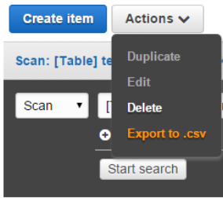

# csv4dynamo



export and import csv for DynamoDB

This is an integration of [ma91n/dynamo2csv](https://github.com/ma91n/dynamo2csv) and [maito1201/csv2dynamo](https://github.com/maito1201/csv2dynamo)

# install

```
go get github.com/maito1201/csv4dynamo/cmd/csv4dynamo
```

# usage

```
csv4dynamo [options]
```

```
NAME:
   csv4dynamo - export and import csv for DynamoDB

USAGE:
   main.exe [global options] command [command options] [arguments...]

COMMANDS:
   import, csv2dynamo, i  import csv to DynamoDB
   export, dynamo2csv, x  export csv from DynamoDB
   help, h                Shows a list of commands or help for one command

GLOBAL OPTIONS:
   --table-name value, -t value                                          [import export] target dynamo db tabe name (required)
   --endpoint value, -e value                                            [import export] endpoint of DynamoDB
   --profile value, -p value                                             [import export] profile of aws cli
   --output value, -o value                                              [import export] target output (default: stdout, e.g. ./out.txt), no file will be created if execute option is enabled
   --csv value, -c value, --file value, -f value                         [import] file to import e.g. ./tablename.csv
   --execute                                                             [import] is directly execute import command (default: false)
   --filter-expression value, --fex value                                [export] DynamoDB Column names order for using csv output
   --expression-attribute-values value, --exp-values value, --xav value  [export] expression-attribute-values to export (e.g. '{":s":{"S":"15:00:00Z"}}')
   --expression-attribute-names value, --exp-names value, --xan value    [export] expression-attribute-names to export (e.g. '{"#ts":"timestamp"}')
   --help, -h                                                            show help (default: false)
2021/03/30 15:00:19 Required flag "table-name" not set
exit status 1
```

# example

## import csv to DynamoDB

```
csv4dynamo --table-name sample-table --file ./testdata/sample.csv --out out.txt import

read and compile csv
progress: 2/2
complete!
aws dynamodb put-item --table-name sample-table --item {"s_value":{"S":"sample1"},"n_value":{"N":"1"},"bool_value":{"B":true}}
aws dynamodb put-item --table-name sample-table --item {"s_value":{"S":"sample2"},"n_value":{"N":"2"},"bool_value":{"B":false}}
```

## export csv from DynamoDB

```
csv4dynamo --table-name sample-table -filter-expression 'contains(#ts, :s)' --out out.csv export
```

# caution

This CLI may not work well with complex table condition(e.g: Table that the data format of the attributes is not unified for each record)
